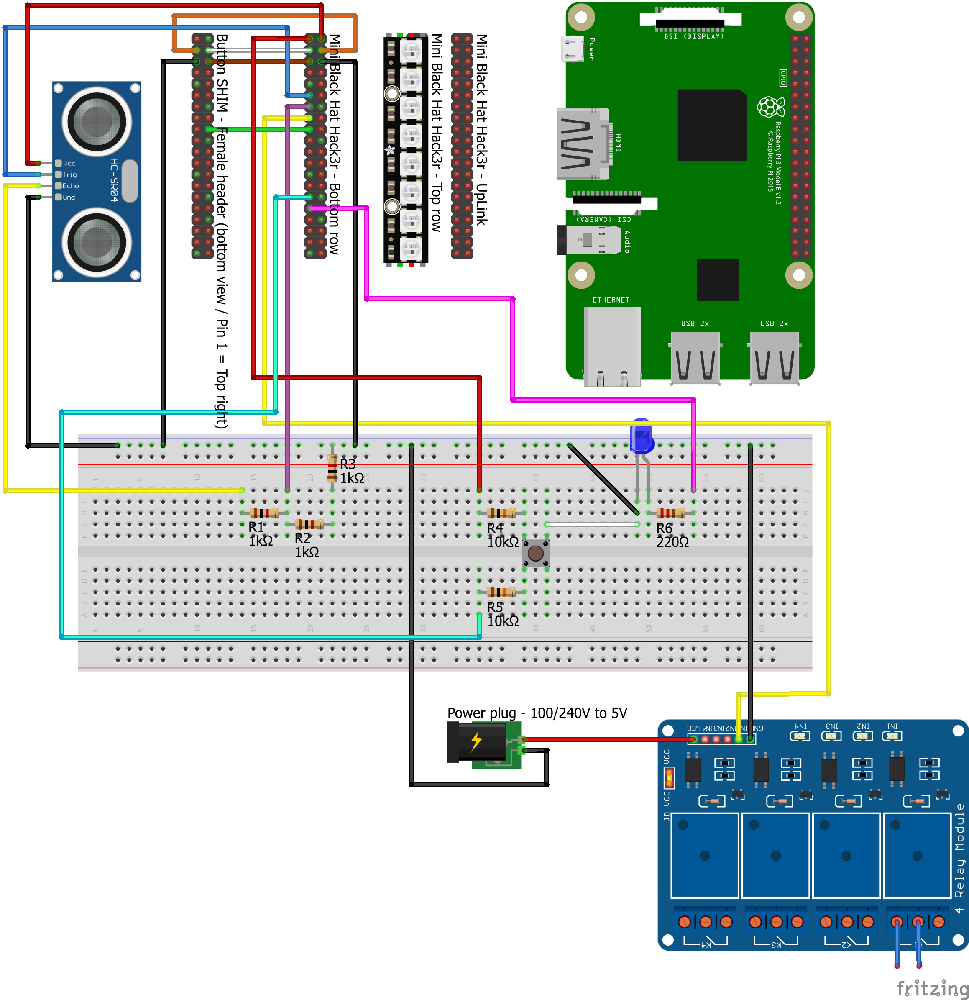

# Components

## Overview

Most (not to say all) parts are available at your local electronics retailer or online.

### 1. Raspberry Pi

[Official doc](https://www.raspberrypi.com/documentation/)  
[Pinout info](https://pinout.xyz)

### 2. Pimoroni Mini Black Hat Hack3r

[Product info](https://shop.pimoroni.com/products/mini-black-hat-hack3r)

### 3. Pimoroni Blinkt!

[Official doc](http://docs.pimoroni.com/blinkt/)  
[Pinout info](https://pinout.xyz/pinout/blinkt)  
[GitHub](https://github.com/pimoroni/blinkt)

### 4. Pimoroni Button SHIM

[Official doc](http://docs.pimoroni.com/buttonshim/)  
[Pinout info](https://pinout.xyz/pinout/button_shim)  
[GitHub](https://github.com/pimoroni/button-shim)  

### 5. Momentary Push Button (NO SPST)

Generic part  
NO = Normally Open  
SPST = Single Pole, Single Throw  
Operations button: has to be pressed simultaneously with one of the buttons on the *Pimoroni Button SHIM* or the request will not be processed.

### 6. LED

Generic part  
Lights up when the operations button is pressed.

### 7. HC-SR04

Generic part  
Popular ultrosonic distance sensor

### 8. Resistors: 3 x 1k Ω + 2 x 10k Ω + 1 x 220 Ω

(We don't want to fry anything.)

### 9. 4-Channel 5V Relay Module

Generic part  
[Opto-isolation explanation](https://electronics.stackexchange.com/questions/505318/how-to-properly-use-a-relay-module-with-jd-vcc-from-arduino-raspberry)  
[Description](https://components101.com/switches/5v-four-channel-relay-module-pinout-features-applications-working-datasheet)

### 10. (Jumper) cables

(How else are we going to connect things?)

## Connection scheme

  

Additional comments:

* Connect the *Raspberry Pi* GPIO header to the *Mini Black Hat Hack3r - UpLink* header using the GPIO ribbon cable.  
**Hint:** Both the *Raspberry Pi* and the *Mini Black Hat Hack3r* in the picture are oriented correctly.
* Put the *Pimoroni Blinkt!* on the *Mini Black Hat Hack3r - Top row* header.  
**Hint:** Make sure the rounded corners are aligned with the dashed line printed on the PCB.  
**Note:** I didn't find a Fritzing part for the *Pimoroni Blinkt!* so I used a visually similar part from Adafruit on the picture.
* *Button SHIM - Female header* : this is the bottom view of the Button SHIM with soldered female header.  
**Info:** The reason I used pins in the image instead of a female connector is that Fritzing does not properly display female connectors on multiple rows.  
**Hint:** Button A (not on the picture) is closest to the pin on the bottom left of the header on the picture.
* The 2 blue wires from Relay 1 are connected to the pump.  
**Hint:** I stripped the pump cable somewhere in the middle, cut the blue wire and connected either cut end to the relay.

## Actual setup
